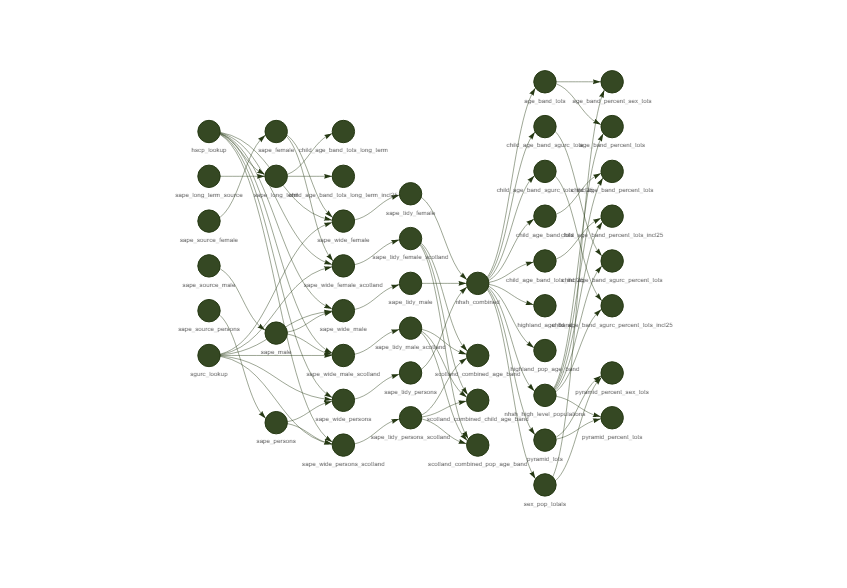
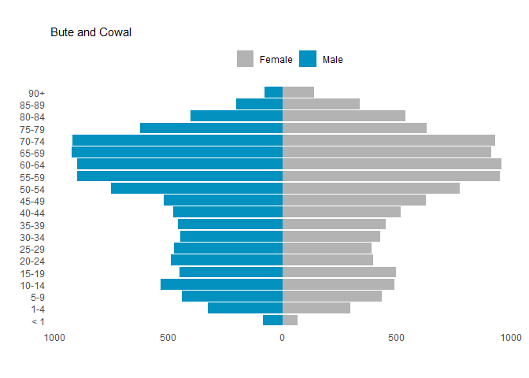
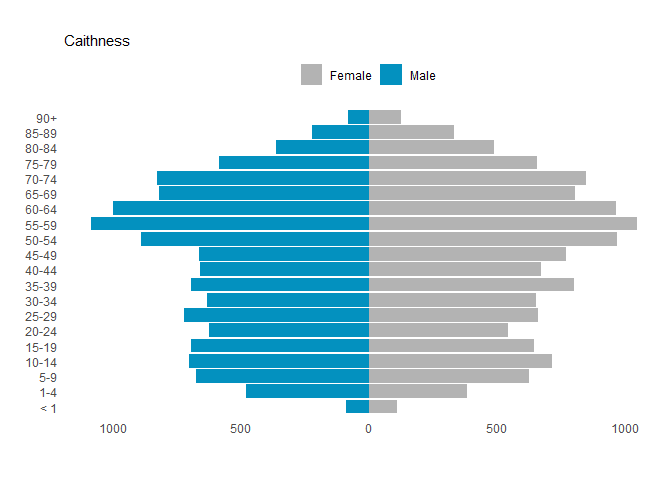
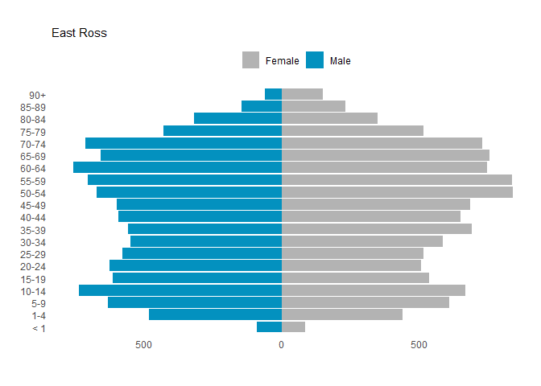
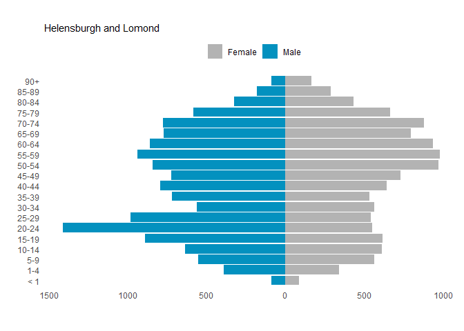
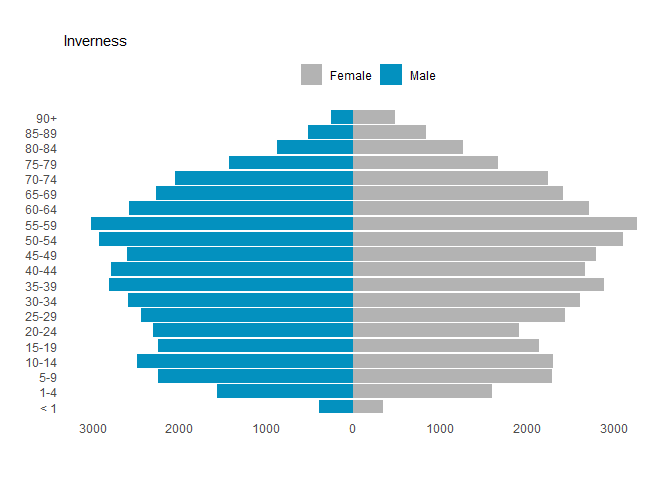
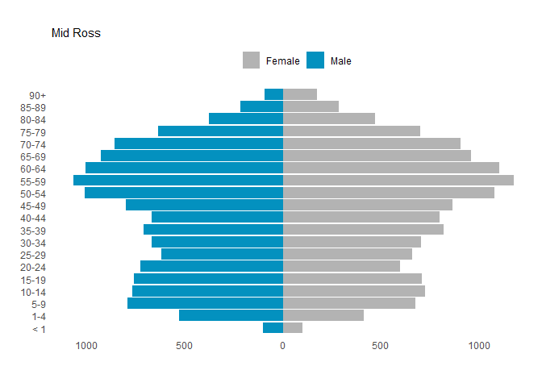
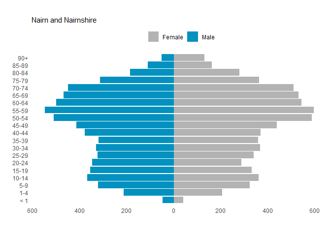
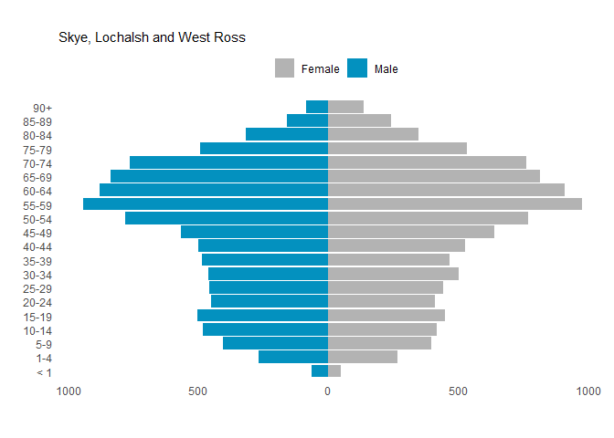

README
================

## pyramid-plots2

Code to tidy and plot SAPE 2021 data as population pyramids with
{targets}, {purrr} and others

Note : the input data (sape-2021-females.xlsx, sape-2021-males.xlsx and
sape-2021-persons.xlsx) is Crown Copyright

Original data sources:

- <https://www.nrscotland.gov.uk/files//statistics/population-estimates/sape-time-series/persons/sape-2021-persons.xlsx>  

- <https://www.nrscotland.gov.uk/files//statistics/population-estimates/sape-time-series/males/sape-2021-males.xlsx>

- <https://www.nrscotland.gov.uk/files//statistics/population-estimates/sape-time-series/females/sape-2021-females.xlsx>

- SGURC :
  <https://www.opendata.nhs.scot/dataset/urban-rural-classification>


<!-- -->

## Pyramid Plots

``` r
hscp <- pyramid_tots %>% distinct(CP_Name) %>% pull() %>% sort()
```

``` r
hscp |>
  purrr::walk(\(x) phi_pop_pyramid(pyramid_tots,
                          hscpval = x,
                          save_plot = FALSE,
                          chart_subtitle = x)) 
```

<!-- --><!-- --><!-- --><!-- --><!-- --><!-- --><!-- --><!-- --><!-- --><!-- --><!-- --><!-- --><!-- -->

## Faceted plot using facet grid and percentages

Child age bands by SGURC classification:

``` r
phi_pop_pyramid_facet(sgurc_tots,
                      councilcol = Council_area_name,
                      councilval = "Highland",
                      localitycol = CP_Name,
                      xcol = child_age_band,
                      ycol = percent_of_tot,
                      fill_col = Sex,
                      UrbanRural8fold2020 ~ CP_Name, # faceting variables
                      percentage = TRUE,
                      gridded = TRUE) # both required for this plot
```

<!-- -->
